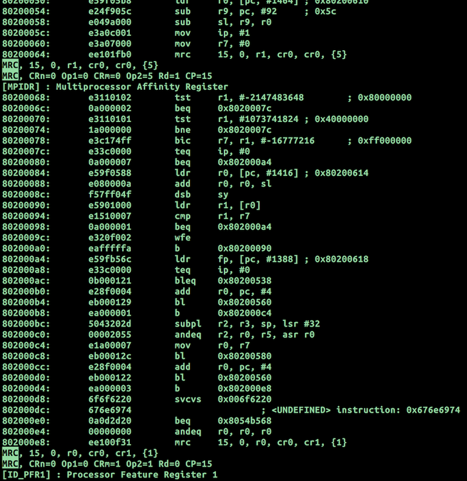

# Introduction
FIXME: THIS IS A HEAVY WIP.
But you can already use it to post-process objdump reports!

libARMCopro is a library to disassemble and pretty-print ARM MCR/MRC instructions. These instructions are commonly used to control MMU and define the behavior of faults/exceptions, and the ISA features exposed to the software (such as VFP, NEON).

Currently upon encountering a coprocessor access via the an MCR/MRC instruction, the disassemblers will only print its arguments (the indices of the corpocessor uses, opcodes and the general-purpose register used to transfer the value between the ARM core and the corpocessor).

libARMCopro will print the human-readable register names and verbose descriptions (as specified in the ARM Techical Reference Manual).
It is designed to aid in debugging low-level code (such as Operating System kernel and Hypervisors) and in reverse-engineering firmware, so that the engineer does not have to consult the reference manual upon each instruction.

It might happen so that different revisions of the instruction set have different meaning for the same binary encoding of an instruction. To account for this, libARMCopro allows the user to specify the version of the instruction set explicitely. If the ISA revision is not specified, it will print the disassembly for all the target variants known to it. 

# Applications
libARMCopro is designed to be used by the disassemblers, and the plan is to integrate it with objdump (from [GNU Binutils](https://www.gnu.org/software/binutils/)), [Apple otool](http://www.opensource.apple.com/source/cctools/), and [radare2](http://www.radare.org/r/).

# Usage
## Decode individual instructions
Just feed the hex values to stdin, alike to addr2line
> echo "0xdeadbeef" | ./arm_mrc stdin

## Process GNU objdump output
> arm-none-eabi-objdump -d foo.elf | ./arm_mrc objdump > out.S

# Screenshots
The screenshot demonstrates using libARMCopro to annotate the disassembly of the Xen initialization code.

# Features
* [x] DONE: Builds with sanitizers
* [x] DONE: Coverage Reports
* [x] DONE: Clang Static Analyzer (Scan-build)
* [?] SOMEWHAT: Integrate with objdump (not really integrated, but a parser for objdump output is available)
* [ ] Peephole mode to track values written to coprocessor registers and decode individual bitfields.
* [ ] Tests
* [ ] Integrate with radare2
* [ ] Consider generating register descriptions automatically by parsing ARM Manuals. TODO: can we get ARM Ltd. to provide ISA description in a machine-readable form such as an XML or JSON? Or should I make one myself using TRMs?

# Supported ARM revisions
The following versions of the ARM TRMs were used to obtain descriptions of coprocessor registers.
* Cortex-A15 r2p0 - [DDI0438C_cortex_a15_r2p0_trm.pdf](http://infocenter.arm.com/help/topic/com.arm.doc.ddi0438c/DDI0438C_cortex_a15_r2p0_trm.pdf)
* Cortex-A9 r4p1 - [DDI0388I_cortex_a9_r4p1_trm.pdf](http://infocenter.arm.com/help/topic/com.arm.doc.ddi0388i/DDI0388I_cortex_a9_r4p1_trm.pdf)
* Cortex-R4 r1p4 - [DDI0363G_cortex_r4_r1p4_trm.pdf](http://infocenter.arm.com/help/topic/com.arm.doc.ddi0363g/DDI0363G_cortex_r4_r1p4_trm.pdf)

# Testing
WIP. This section currently describes what *should* be done, not what *is* already done.

## Unit testing
For each internal function, tests are provided to ensure they work correctly on a certain subset of data.

Each public function is tested with certain valid and invalid inputs to check they are handled correctly.

In the "full" testing mode, each public function is tested by evaluating all possible inputs brute-force style. The code is built with *sanitizers* to ensure it does not contain a certain set of errors, such as using uninitialized data, out-of-bound array access and memory corruption.
Coverage is measured using GCC GCOV and [LLVM COV](http://llvm.org/docs/CommandGuide/llvm-cov.html).

# Useful Links
Here are the hyperlinks to several resources that could be useful while developing low-level ARM code, not necessary relevant to this library.

* [LLVM Cov coverage tool](http://llvm.org/docs/CommandGuide/llvm-cov.html)
* [LLVM Code Coverage Mapping Format](http://llvm.org/docs/CoverageMappingFormat.html)
* [Using GCOV in Low-level code](http://allsoftwaresucks.blogspot.ru/2015/05/gcov-is-amazing-yet-undocumented.html)
* [ARM Cortex-A9 Techical Reference Manual (online HTML)](http://infocenter.arm.com/help/index.jsp?topic=/com.arm.doc.ddi0388e/index.html)
* [ARM Cortex-A15 Techical Reference Manual (online HTML)](http://infocenter.arm.com/help/index.jsp?topic=/com.arm.doc.ddi0438i/index.html)
* [ARM Cortex-R4 Techical Reference Manual (online HTML)](http://infocenter.arm.com/help/index.jsp?topic=/com.arm.doc.ddi0363e/index.html)
